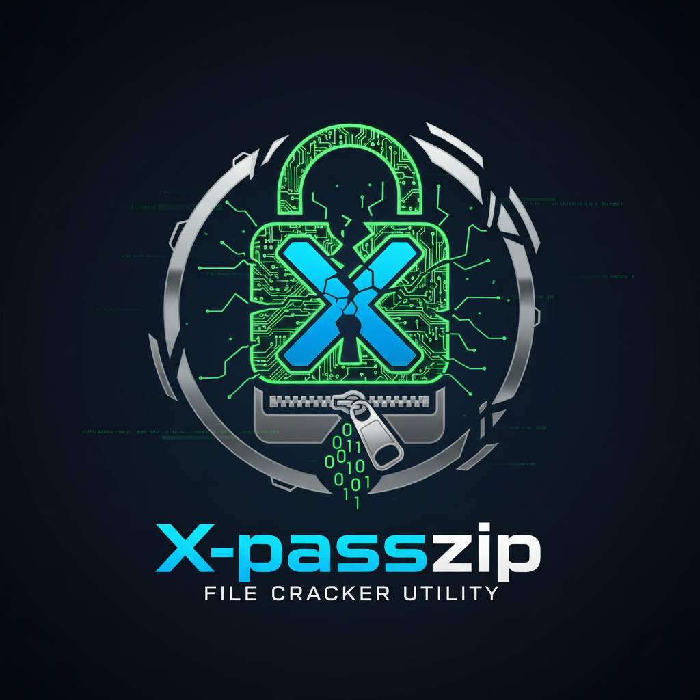

# X-Repass - Archive Password Recovery Tool

<p align="center">
  
</p>

<p align="center">
  <strong>Professional Archive Password Recovery with CPU + GPU Acceleration</strong>
</p>

<p align="center">
  <a href="#features">Features</a> •
  <a href="#screenshots">Screenshots</a> •
  <a href="#installation">Installation</a> •
  <a href="#usage">Usage</a> •
  <a href="#architecture">Architecture</a>
</p>

---

## Features

### Multi-Engine Password Cracking
| Engine | Speed | Best For |
|--------|-------|----------|
| **CPU** | ~500K/s | Dictionary attacks, short passwords |
| **GPU (Hashcat)** | ~50M/s | Brute-force, complex passwords |
| **Hybrid** | Maximum | Combines both for optimal performance |

### Supported Archive Types
- **ZIP** - PKZIP (ZipCrypto), WinZip AES-128/192/256
- **RAR** - RAR3, RAR4, RAR5 with AES-256
- **7-Zip** - 7z with AES-256 encryption
- **SFX/EXE** - Self-extracting archives

### Attack Modes

| Mode | Description | Use Case |
|------|-------------|----------|
| **Smart** | Auto-detects best strategy | General purpose |
| **Dictionary** | Uses wordlist (rockyou.txt) | Common passwords |
| **Numbers Only** | 0-9 | PIN codes, numeric passwords |
| **Lowercase** | a-z | Simple text passwords |
| **Alphanumeric** | a-z, A-Z, 0-9 | Standard passwords |
| **All Characters** | Full charset + symbols | Complex passwords |
| **Pattern** | Custom mask attack | Known password structure |

### Advanced Features

#### Checkpoint & Resume System
- Auto-saves progress every 60 seconds
- Resume from exact position after crash or close
- Asks to resume when reopening same file
- Tracks both CPU dictionary position and GPU progress

#### Watchdog Service
- Monitors for program hangs
- Automatically kills orphaned hashcat processes
- Heartbeat mechanism ensures UI responsiveness
- Emergency cleanup on crash detection

#### Real-time Monitoring
- Live password testing display
- Speed (passwords/second) for both CPU and GPU
- Progress percentage and ETA
- CPU/GPU temperature monitoring
- Current attack pattern display

#### Smart UI
- **Neon RGB Theme** - Modern dark theme with animated effects
- **Responsive Design** - Adapts to window size
- **Dual Log Panels** - Separate CPU and GPU logs
- **Auto-clear Logs** - Prevents memory overflow
- **Hidden Scrollbars** - Clean, minimal interface

---

## Screenshots

```
┌─────────────────────────────────────────────────────────────┐
│  X-Repass - Archive Password Recovery                    ─ □ ✕ │
├─────────────────────────────────────────────────────────────┤
│  📁 File: secret_archive.zip          [Browse] [▶ START]     │
│  📊 Type: WinZip AES-256                                     │
├───────────────────────┬─────────────────────────────────────┤
│  ⚡ CPU ENGINE        │  🎮 GPU ENGINE (HASHCAT)             │
│  ══════════════════   │  ══════════════════                  │
│  Status: Running      │  Status: Running                     │
│  Speed: 524,288/s     │  Speed: 48,576,000/s                 │
│  Progress: 45.2%      │  Progress: 23.8%                     │
│  Pattern: Dictionary  │  Pattern: ?l?l?l?l?d?d               │
│                       │                                      │
│  [CPU Log...]         │  [GPU Log...]                        │
└───────────────────────┴─────────────────────────────────────┘
```

---

## Installation

### Requirements
- Windows 10/11 (64-bit)
- .NET 8.0 Runtime
- 4GB+ RAM recommended
- (Optional) NVIDIA/AMD GPU with Hashcat support

### Quick Start

1. **Download** the latest release
2. **Extract** to a folder
3. **Run** `ZipPasswordCracker.exe`

### Optional Tools (Auto-downloaded)

| Tool | Purpose | Auto-Download |
|------|---------|---------------|
| Hashcat | GPU acceleration | Manual setup |
| rockyou.txt | Dictionary wordlist | Yes (139MB) |
| 7z2john | 7-Zip hash extraction | Yes |
| Perl | Required for john tools | Yes |

---

## Usage

### Basic Usage

1. **Open Archive** - Click Browse or drag & drop
2. **Select Mode** - Smart mode recommended for beginners
3. **Configure**:
   - Password length range (1-16)
   - Character sets (numbers, lowercase, etc.)
   - CPU/GPU engines
4. **Start** - Click START button
5. **Wait** - Password displayed when found

### Advanced Usage

#### Resume Previous Session
When opening a file with saved checkpoint:
```
┌─────────────────────────────────────────┐
│  พบ checkpoint สำหรับไฟล์นี้:            │
│  - ทดสอบแล้ว: 1,234,567 รหัส            │
│  - ตำแหน่ง Dictionary: บรรทัด 50,000     │
│  - GPU Progress: 35.2%                  │
│                                         │
│  ต้องการ Resume จากจุดที่หยุดไว้หรือไม่?  │
│                                         │
│        [Yes]              [No]          │
└─────────────────────────────────────────┘
```

#### Pattern Attack Examples
| Pattern | Matches | Example |
|---------|---------|---------|
| `?d?d?d?d` | 4 digits | 1234 |
| `?l?l?l?l` | 4 lowercase | abcd |
| `pass?d?d` | pass + 2 digits | pass99 |
| `?u?l?l?l?d?d?d` | Upper + 3 lower + 3 digits | Pass123 |

#### Mask Characters
| Mask | Character Set |
|------|---------------|
| `?d` | Digits (0-9) |
| `?l` | Lowercase (a-z) |
| `?u` | Uppercase (A-Z) |
| `?s` | Symbols (!@#$...) |
| `?a` | All printable |

---

## Architecture

### Core Components

```
┌─────────────────────────────────────────────────────────────┐
│                      MainWindow.xaml.cs                      │
│                    (UI & Coordination)                       │
├─────────────────────┬───────────────────────────────────────┤
│   ZipCrackEngine    │          Hashcat Process              │
│   (CPU Cracking)    │          (GPU Cracking)               │
├─────────────────────┼───────────────────────────────────────┤
│  HashFormatDetector │         CheckpointManager             │
│  (Hash Extraction)  │         (Progress Saving)             │
├─────────────────────┼───────────────────────────────────────┤
│   WatchdogService   │         DatabaseManager               │
│  (Crash Detection)  │         (Settings Storage)            │
└─────────────────────┴───────────────────────────────────────┘
```

### File Structure

| File | Description |
|------|-------------|
| `MainWindow.xaml.cs` | Main UI, attack coordination, progress display |
| `ZipCrackEngine.cs` | CPU-based password testing engine |
| `HashFormatDetector.cs` | Extract hashes from archives for Hashcat |
| `CheckpointManager.cs` | Save/restore attack progress |
| `WatchdogService.cs` | Monitor for hangs, cleanup orphaned processes |
| `DatabaseManager.cs` | SQLite storage for settings and history |
| `WorkChunkManager.cs` | Divide work between CPU and GPU |

### Performance Optimization

- **Batch Processing** - Tests passwords in batches of 1000
- **Parallel Threads** - Uses all CPU cores
- **Log Throttling** - Auto-clears logs every 10 seconds
- **Heartbeat System** - 5-second UI responsiveness checks
- **Smart Work Division** - GPU gets 95% of brute-force work

---

## Troubleshooting

### Common Issues

| Problem | Solution |
|---------|----------|
| Program freezes | Watchdog will auto-recover, checkpoint saved |
| Hashcat not found | Set path in Settings (gear icon) |
| GPU not detected | Install latest GPU drivers |
| Archive not supported | Check if archive is actually encrypted |
| Resume not working | Ensure checkpoint file exists |

### Log Files

Logs are stored in:
```
%LOCALAPPDATA%\X-Repass\
├── watchdog.log      # Crash detection logs
├── checkpoints\      # Saved progress files
└── settings.db       # Application settings
```

---

## Version History

### v1.2.0 (Current)
- Added WatchdogService for crash detection
- Fixed UI freeze from cross-thread access
- Auto-save checkpoint every 60 seconds
- Auto-clear GPU log to prevent overflow
- Hidden scrollbars for cleaner UI
- Improved resume system with user prompt

### v1.1.0
- Hybrid CPU/GPU work division
- Pattern display during attack
- Pause/Resume support

### v1.0.0
- Initial release
- CPU + GPU cracking
- Multiple archive format support

---

## License

Copyright 2025 XMan Studio. All rights reserved.

---

<p align="center">
  <strong>Made with ❤️ by XMan Studio</strong>
</p>
